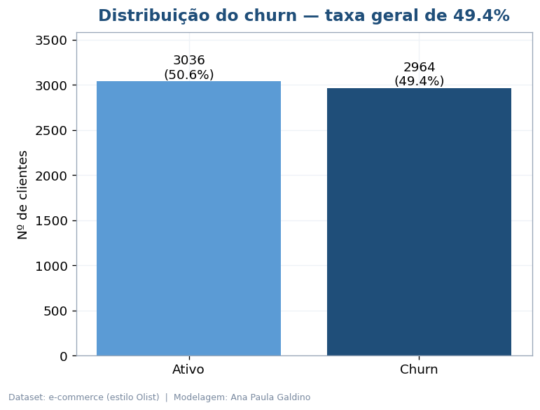
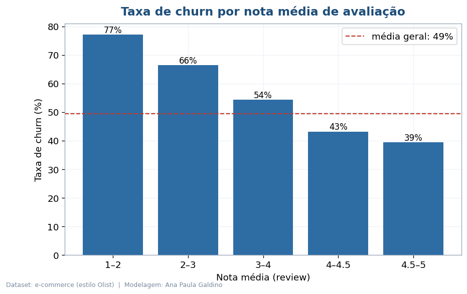
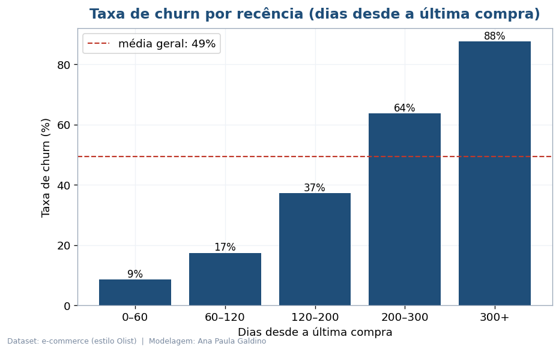
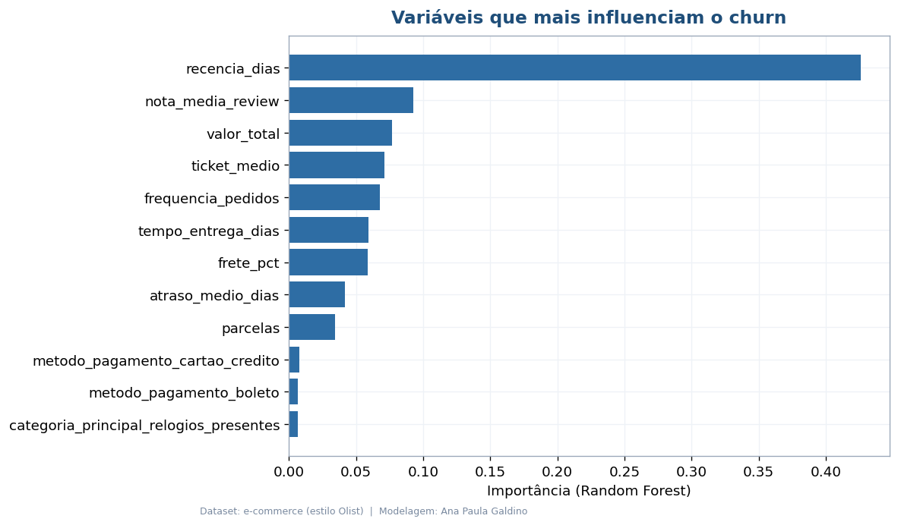
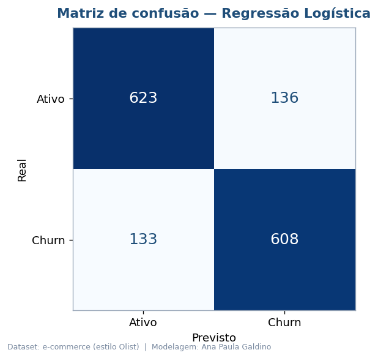
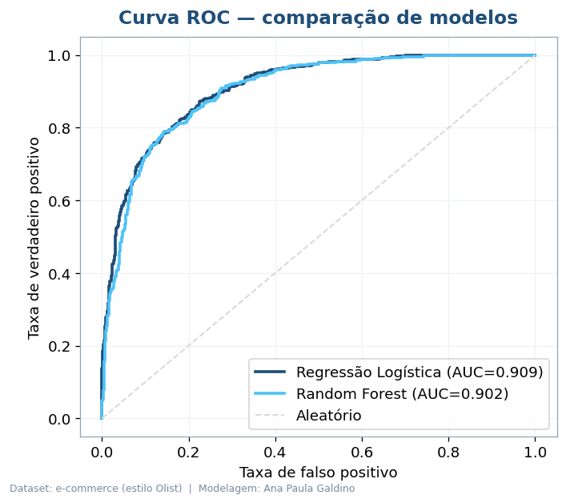

# 🤖 Previsão de Churn de Clientes — E-commerce (Machine Learning)

Projeto de **Machine Learning aplicado a negócios** que prevê quais clientes de um e-commerce
têm maior probabilidade de **churn** (deixar de comprar). A partir do comportamento de compra
e da experiência do cliente, o modelo identifica quem está em risco — permitindo agir na
retenção **antes** da perda. Inclui **6 visualizações executivas** e uma **análise em PDF**.

Inspirado na estrutura do **Brazilian E-Commerce Public Dataset (Olist)**, conecta-se ao meu
[Tech Challenge da pós em Data Analytics](https://github.com/AnaPaula-Galdino/tech-challenge-olist-analytics).

> 📄 **[Análise Executiva (PDF)](Analise_Executiva_Churn.pdf)**

---

## 🎯 Problema de negócio

Reter custa menos que conquistar. O desafio é **antecipar** quem vai sair. Aqui, churn =
*cliente sem nova compra nos últimos 6 meses*, e o modelo aprende os padrões que antecedem a saída.

## 🧠 Abordagem

1. **Features (RFM + experiência):** recência, frequência, valor gasto, ticket médio, tempo e
   atraso de entrega, nota média de avaliação, peso do frete, parcelas, categoria e pagamento.
2. **Pré-processamento:** padronização (numéricas) + one-hot encoding (categóricas).
3. **Modelagem:** comparação entre **Regressão Logística** e **Random Forest**.
4. **Avaliação:** accuracy, precisão, recall, F1 e ROC AUC, com matriz de confusão e curva ROC.

## 📊 Resultados

| Modelo | Acurácia | Precisão | Recall | F1 | ROC AUC |
|---|---|---|---|---|---|
| **Regressão Logística** | 0,821 | 0,817 | 0,821 | 0,819 | **0,909** |
| Random Forest | 0,810 | 0,803 | 0,815 | 0,809 | 0,902 |

O modelo acerta a saída do cliente em **~82%** dos casos, com **ROC AUC de 0,91**.

## 📈 Visualizações

| | |
|---|---|
|  |  |
|  |  |
|  |  |

### Principais achados

- **Recência** é o fator dominante de churn, seguida por **satisfação** e **valor gasto**.
- Clientes com nota **1–2** têm **77%** de churn; com nota **4.5–5**, apenas **39%**.
- Clientes inativos há **+300 dias** concentram as maiores taxas de saída.

## 🛠️ Tecnologias

**Python 3.10+** · **scikit-learn** · **pandas** · **numpy** · **matplotlib** · **reportlab**

## 📂 Estrutura

```
churn-prediction-ecommerce/
├── README.md
├── Analise_Executiva_Churn.pdf     # Relatório executivo (PDF)
├── requirements.txt
├── dados/clientes_churn.csv        # Dataset (gerado por src/gerar_dados.py)
├── src/
│   ├── gerar_dados.py              # Gera o dataset
│   ├── modelo_churn.py             # Treina, avalia e gera os 6 gráficos
│   └── gerar_relatorio.py          # Gera o PDF executivo
└── imagens/                        # 6 gráficos (PNG)
```

## ▶️ Como executar

```bash
pip install -r requirements.txt
python src/gerar_dados.py        # (opcional) recria o dataset
python src/modelo_churn.py       # treina e gera os gráficos
python src/gerar_relatorio.py    # gera a análise executiva em PDF
```

## 🗂️ Sobre os dados

O dataset (6.000 clientes) é **sintético**, construído para reproduzir padrões realistas de
e-commerce com base na estrutura da Olist — tornando o projeto **100% reproduzível** sem
downloads. Para usar dados reais, basta extrair as mesmas features do
[dataset da Olist no Kaggle](https://www.kaggle.com/datasets/olistbr/brazilian-ecommerce)
e apontar o pipeline para o novo CSV.

---

👤 **Ana Paula Galdino** · Pós-graduação em Data Analytics (POSTECH/FIAP)
[GitHub](https://github.com/AnaPaula-Galdino) · [LinkedIn](https://linkedin.com/in/galdinoana/)
